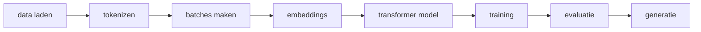
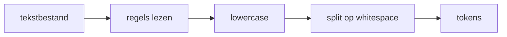

# MiniGPT Theory Book

Een theorieboek over `gpt_lib`, `train.py`, en het trainingsproces van dit MiniGPT-systeem.

Dit boek legt uit wat er conceptueel gebeurt in de pipeline:



Het doel is niet om elke coderegel uit te leggen, maar om de concepten, configuraties, formules en ontwerpkeuzes achter het systeem begrijpelijk te maken.

---

## Table Of Contents

1. [Wat Dit Systeem Bouwt](#1-wat-dit-systeem-bouwt)
2. [De Complete Pipeline](#2-de-complete-pipeline)
3. [Pre-Training En Next Token Prediction](#3-pre-training-en-next-token-prediction)
4. [Data Laden](#4-data-laden)
5. [Train/Validation Split](#5-trainvalidation-split)
6. [Tokenizer](#6-tokenizer)
7. [Vocabulary En Unknown Tokens](#7-vocabulary-en-unknown-tokens)
8. [Van Tokens Naar Training Voorbeelden](#8-van-tokens-naar-training-voorbeelden)
9. [Embeddings](#9-embeddings)
10. [Self-Attention](#10-self-attention)
11. [Causal Masking](#11-causal-masking)
12. [Transformer Block](#12-transformer-block)
13. [MiniGPT Model Architectuur](#13-minigpt-model-architectuur)
14. [Logits, Softmax En Waarschijnlijkheden](#14-logits-softmax-en-waarschijnlijkheden)
15. [Loss Function](#15-loss-function)
16. [Optimizer En Learning Rate](#16-optimizer-en-learning-rate)
17. [Training Loop](#17-training-loop)
18. [Validation, Perplexity En Token Accuracy](#18-validation-perplexity-en-token-accuracy)
19. [Regularisatie](#19-regularisatie)
20. [Checkpointing](#20-checkpointing)
21. [Text Generation](#21-text-generation)
22. [Top-K Diagnostics](#22-top-k-diagnostics)
23. [Concept Benchmark](#23-concept-benchmark)
24. [Long Context Evaluation](#24-long-context-evaluation)
25. [Alle Configuratie Waarden](#25-alle-configuratie-waarden)
26. [Welke Configs In De AI-Formules Zitten](#26-welke-configs-in-de-ai-formules-zitten)
27. [Goede Waarden Voor Dit Model](#27-goede-waarden-voor-dit-model)
28. [Grenzen Van Dit Systeem](#28-grenzen-van-dit-systeem)
29. [Advanced Technologieen En Toekomst](#29-advanced-technologieen-en-toekomst)
30. [Experiment Resultaten En Vergelijking](#30-experiment-resultaten-en-vergelijking)
31. [Samenvatting](#31-samenvatting)

---

## 1. Wat Dit Systeem Bouwt

Dit project bouwt een kleine GPT-achtige language model library.

De kern bestaat uit:

- `train.py`: startpunt dat de training orkestreert.
- `gpt_lib/data.py`: data laden, splitsen en voorbereiden.
- `gpt_lib/tokenizer.py`: tekst omzetten naar token IDs.
- `gpt_lib/model.py`: MiniGPT model met embeddings, self-attention en feed-forward layers.
- `gpt_lib/trainer.py`: training loop, validation, early stopping en checkpointing.
- `gpt_lib/generator.py`: tekst genereren uit een getraind model.
- `gpt_lib/diagnostics.py`: top-k predictions, tokenizer coverage, concept benchmark en long-context evaluatie.
- `gpt_lib/config.py`: centrale configuratie van model, data, training en diagnostics.

Het model is een klein autoregressief taalmodel. Autoregressief betekent: het voorspelt het volgende token op basis van eerdere tokens.

Voorbeeld:

```text
Input context:
machine learning uses

Target:
data
```

Het model leert dus niet door labels zoals `positief` of `negatief`, maar door steeds het volgende woord/token te voorspellen.

---

## 2. De Complete Pipeline

De volledige trainingflow ziet er zo uit:

```text
1. Config maken
2. Data lezen uit tekstbestanden
3. Domain data eventueel herhalen
4. Tokens maken met whitespace splitting
5. Train/validation split maken
6. Vocabulary bouwen
7. Tokens encoden naar integer IDs
8. Sliding-window voorbeelden maken
9. MiniGPT model bouwen
10. Optimizer en loss function maken
11. Trainen met next-token prediction
12. Validation metrics berekenen
13. Beste model eventueel herstellen
14. Checkpoint opslaan
15. Sample genereren
16. Diagnostics draaien
```

Belangrijk: `train.py` hoort vooral de dirigent te zijn. De echte herbruikbare logica staat in `gpt_lib`.

Een goede mentale verdeling:

| Onderdeel | Verantwoordelijkheid |
|---|---|
| `train.py` | Run configureren en workflow starten |
| `gpt_lib/data.py` | Dataset voorbereiden |
| `gpt_lib/tokenizer.py` | Tekst <-> token IDs |
| `gpt_lib/model.py` | Neuraal netwerk |
| `gpt_lib/trainer.py` | Leren en evalueren |
| `gpt_lib/generator.py` | Sampling/generatie |
| `gpt_lib/diagnostics.py` | Begrijpen wat het model voorspelt |

---

## 3. Pre-Training En Next Token Prediction

Dit systeem doet pre-training.

Pre-training betekent: het model leert algemene patronen uit grote hoeveelheden tekst voordat het later eventueel instruction tuning of conversational tuning krijgt.

De taak is next token prediction, vaak afgekort als NTP.

De basisformule:

```text
P(x_t | x_1, x_2, ..., x_{t-1})
```

Dit betekent:

```text
Wat is de kans op token x_t, gegeven alle vorige tokens?
```

Voorbeeld:

```text
Context:
the white house said the

Mogelijke next tokens:
president, administration, government, statement
```

Het model produceert geen direct woord als antwoord. Het produceert eerst scores voor alle tokens in de vocabulary. Die scores noemen we logits.

Daarna worden logits via softmax omgezet naar kansen.

---

## 4. Data Laden

Data laden gebeurt conceptueel in deze stappen:

```text
tekstbestand -> regels lezen -> lowercase -> split op whitespace -> tokens
```



De belangrijkste configwaarden:

| Config | Betekenis |
|---|---|
| `data_path` | Hoofdtrainingsbestand |
| `domain_data_path` | Extra domeinspecifieke data |
| `domain_data_repeats` | Hoe vaak domeindata herhaald wordt |
| `max_data_size` | Maximum aantal tokens dat geladen wordt |

In de huidige config:

```text
data_path = data/train-31-32-33-of-00080.txt
domain_data_path = data/data.txt
domain_data_repeats = 3
max_data_size = 300_000
```

Dit betekent:

1. Eerst wordt domeindata uit `data/data.txt` gelezen.
2. Die domeindata wordt drie keer toegevoegd.
3. Daarna wordt de algemene dataset toegevoegd totdat `max_data_size` bereikt is.

Waarom domeindata herhalen?

Omdat kleine modellen snel vergeten of ondervertegenwoordigde onderwerpen slecht leren. Door relevante data vaker te geven, krijgt het model meer trainingssignaal voor dat domein.

Trade-off:

| Meer domain repeats | Effect |
|---|---|
| Voordeel | Sterkere domeinkennis |
| Nadeel | Meer risico op overfitting en minder algemene taalvaardigheid |

---

## 5. Train/Validation Split

Training data is de tekst waarop het model leert.

Validation data is tekst waarop het model niet traint, maar waarmee gemeten wordt of het model generaliseert.

De config:

```text
validation_split = 0.2
```

Betekent:

```text
80% training
20% validation
```

Het systeem probeert eerst op zinnen te splitsen. Als dat niet goed kan, gebruikt het een fallback waarbij het laatste deel van de tokens validation wordt.

Waarom validation nodig is:

- Train loss zegt of het model de trainingsdata leert.
- Validation loss zegt of het model ook onbekende tekst voorspelt.
- Als train loss daalt maar validation loss stijgt, ontstaat overfitting.

---

## 6. Tokenizer

De tokenizer zet tekst om naar token IDs.

Dit systeem gebruikt op dit moment een word-level tokenizer met whitespace splitting.

Voorbeeld:

```text
"machine learning uses data"
```

Wordt:

```text
["machine", "learning", "uses", "data"]
```

Daarna krijgt elk woord een integer ID:

```text
machine -> 12
learning -> 48
uses -> 7
data -> 3
```

Dan wordt de tekst:

```text
[12, 48, 7, 3]
```

Voordelen van deze tokenizer:

- Simpel.
- Makkelijk te begrijpen.
- Goed voor een educatief MiniGPT-model.
- Snelle vocabulary build.

Nadelen:

- Woorden die niet in de vocabulary zitten worden `<UNK>`.
- Woordvarianten worden los geleerd, bijvoorbeeld `run`, `running`, `runs`.
- Zeldzame woorden kosten veel vocabulary ruimte.
- Het model kan onbekende woorden niet netjes in stukjes opdelen.

Modernere GPT-systemen gebruiken meestal subword tokenization, zoals BPE, WordPiece of SentencePiece.

---

## 7. Vocabulary En Unknown Tokens

De vocabulary is de lijst met tokens die het model kent.

De config:

```text
max_vocab = 10000
```

Betekent:

```text
Bewaar maximaal 10.000 tokens.
```

Het systeem telt alle woorden in de trainingstekst en bewaart de meest voorkomende woorden.

Er is altijd een speciaal token:

```text
<UNK>
```

Dat betekent unknown.

Als een token niet in de vocabulary staat, wordt het vervangen door `<UNK>`.

Voorbeeld:

```text
Input:
["python", "neuro-symbolic", "software"]

Vocabulary bevat:
python, software

Encoded:
[id_python, id_UNK, id_software]
```

Waarom `<UNK>` belangrijk is:

- Het voorkomt crashes bij onbekende woorden.
- Het maakt encoding altijd mogelijk.

Waarom `<UNK>` problematisch is:

- Alle onbekende woorden worden hetzelfde.
- Het model verliest betekenis.
- `qwerty`, `neuro-symbolic`, en `superconductivity` kunnen allemaal dezelfde `<UNK>` worden.

Daarom meet `gpt_lib` tokenizer coverage:

| Metric | Betekenis |
|---|---|
| `unknown_rate` | Percentage tokens dat onbekend is |
| `vocab_coverage` | Hoeveel unieke tokens bekend zijn |
| `rare_training_tokens` | Tokens die weinig voorkomen |
| `top_unknown_tokens` | Meest voorkomende onbekende tokens |

Goede richtlijn:

```text
unknown_rate < 1% is goed
unknown_rate 1-5% is acceptabel
unknown_rate > 5% is vaak problematisch
```

---

## 8. Van Tokens Naar Training Voorbeelden

Een taalmodel leert niet van losse tokens, maar van contextvensters.

De config:

```text
block_size = 32
```

Betekent:

```text
Het model kijkt maximaal 32 tokens terug.
```

Voor een tokenreeks:

```text
[10, 11, 12, 13, 14]
```

En `block_size = 4`, maakt het datasetvoorbeeld:

```text
x = [10, 11, 12, 13]
y = [11, 12, 13, 14]
```

Het model krijgt `x` en moet voor elke positie het volgende token voorspellen:

```text
10 -> 11
11 -> 12
12 -> 13
13 -> 14
```

Dit is de kern van next-token prediction.

---

## 9. Embeddings

Een token ID is alleen een getal. Het getal `42` heeft op zichzelf geen betekenis.

Daarom gebruikt het model embeddings.

Een embedding is een vector:

```text
token_id -> [0.12, -0.44, 0.03, ...]
```

De config:

```text
embed_dim = 64
```

Betekent:

```text
Elke token wordt een vector van 64 getallen.
```

Het model heeft twee soorten embeddings:

1. Token embeddings.
2. Position embeddings.

Token embedding:

```text
welk woord/token is dit?
```

Position embedding:

```text
op welke positie in de context staat dit token?
```

In het model:

```text
x = token_embedding + position_embedding
```

Waarom position embeddings nodig zijn:

Zonder positie weet het model niet of `dog bites man` anders is dan `man bites dog`.

Formule:

```text
h_i = E_token[x_i] + E_pos[i]
```

Waar:

- `h_i` is de input vector op positie `i`.
- `E_token` is de token embedding matrix.
- `E_pos` is de position embedding matrix.
- `x_i` is het token ID op positie `i`.

---

## 10. Self-Attention

Self-attention is het mechanisme waarmee tokens naar andere tokens in dezelfde context kijken.

Voorbeeld:

```text
the president said he
```

Bij `he` moet het model kunnen kijken naar `president`.

Self-attention maakt drie projecties:

```text
Q = query
K = key
V = value
```

In dit systeem:

```text
Q = xW_q
K = xW_k
V = xW_v
```

De attention score:

```text
scores = QK^T / sqrt(C)
```

Waar:

- `C` is `embed_dim`.
- `sqrt(C)` stabiliseert de scores.

Daarna:

```text
weights = softmax(scores)
output = weights V
```

Intuïtie:

- Query vraagt: waar zoek ik naar?
- Key zegt: wat bied ik aan?
- Value bevat de informatie die wordt doorgegeven.

---

## 11. Causal Masking

Een GPT-model mag tijdens training niet naar toekomstige tokens kijken.

Bij next-token prediction moet het model voorspellen op basis van het verleden, niet op basis van het antwoord.

Daarom gebruikt het model een causal mask.

Voorbeeld met 4 posities:

```text
1 0 0 0
1 1 0 0
1 1 1 0
1 1 1 1
```

Positie 1 mag alleen zichzelf zien.

Positie 2 mag positie 1 en 2 zien.

Positie 3 mag positie 1, 2 en 3 zien.

Positie 4 mag positie 1, 2, 3 en 4 zien.

De toekomst krijgt score:

```text
-inf
```

Na softmax wordt dat praktisch:

```text
0% attention
```

Dit is essentieel voor autoregressieve modellen.

---

## 12. Transformer Block

Een transformer block in dit systeem bestaat uit:

```text
LayerNorm -> SelfAttention -> Residual
LayerNorm -> FeedForward -> Residual
```

In simpele vorm:

```text
x = x + attention(norm(x))
x = x + feed_forward(norm(x))
```

Residual connections helpen omdat informatie en gradients makkelijker door diepe netwerken bewegen.

LayerNorm stabiliseert activaties.

Feed-forward netwerk:

```text
Linear(embed_dim, embed_dim * 4)
GELU()
Linear(embed_dim * 4, embed_dim)
Dropout()
```

Met `embed_dim = 64` wordt de hidden layer:

```text
64 * 4 = 256
```

Waarom `* 4`?

Dit is een klassieke transformer-keuze. De feed-forward laag krijgt tijdelijk meer capaciteit om patronen te verwerken, en projecteert daarna terug naar `embed_dim`.

---

## 13. MiniGPT Model Architectuur

Het model bestaat uit:

```text
token_embedding
position_embedding
dropout
GPTBlock x num_blocks
LayerNorm
Linear head naar vocabulary
```

Met de huidige config:

```text
embed_dim = 64
block_size = 32
num_blocks = 2
dropout = 0.1
max_vocab = 10000
```

De output shape van het model:

```text
B x T x V
```

Waar:

- `B` = batch size.
- `T` = sequence length / block size.
- `V` = vocabulary size.

Voorbeeld:

```text
batch_size = 128
block_size = 32
vocab_size = 10000
```

Output:

```text
128 x 32 x 10000
```

Dat betekent:

Voor elke batch, voor elke positie, geeft het model een score voor elk token in de vocabulary.

---

## 14. Logits, Softmax En Waarschijnlijkheden

De model output heet logits.

Logits zijn ruwe scores, geen kansen.

Voorbeeld:

```text
data: 2.4
model: 1.1
car: -0.5
```

Softmax zet logits om naar kansen:

```text
P(token_i) = exp(logit_i) / sum(exp(logit_j))
```

Na softmax:

```text
data: 70%
model: 20%
car: 10%
```

Tijdens training gebruikt `CrossEntropyLoss` intern deze softmax-logica.

Tijdens generatie gebruikt de generator softmax om een volgend token te samplen.

---

## 15. Loss Function

Het systeem gebruikt cross entropy loss.

Cross entropy meet hoe fout de voorspelde kansverdeling is tegenover het juiste token.

Simpel:

```text
loss = -log(P(correct_token))
```

Als het model het juiste token hoge kans geeft:

```text
P(correct) = 0.90
loss = laag
```

Als het model het juiste token lage kans geeft:

```text
P(correct) = 0.01
loss = hoog
```

Voor alle tokens in een batch:

```text
loss = gemiddelde cross entropy over B * T voorspellingen
```

Waar:

- `B` komt van `batch_size`.
- `T` komt van `block_size`.

Daarom hebben `batch_size` en `block_size` invloed op de stabiliteit van de loss.

---

## 16. Optimizer En Learning Rate

Het systeem gebruikt:

```text
AdamW
```

AdamW is een optimizer die de gewichten van het model aanpast op basis van gradients.

Belangrijke configs:

```text
learning_rate = 8e-4
weight_decay = 1e-4
grad_clip = 1.0
```

Learning rate bepaalt hoe groot elke update is.

Te hoog:

```text
loss springt of wordt instabiel
```

Te laag:

```text
model leert heel langzaam
```

Weight decay is regularisatie. Het duwt gewichten licht richting kleinere waarden.

Grad clipping begrenst de gradient norm:

```text
als gradient te groot wordt -> knip naar max 1.0
```

Dit helpt tegen exploding gradients.

---

## 17. Training Loop

Per epoch gebeurt:

```text
voor elke batch:
    x, y naar device
    logits = model(x)
    loss = cross_entropy(logits, y)
    optimizer.zero_grad()
    loss.backward()
    clip gradients
    optimizer.step()
```

Conceptueel:

1. Forward pass: model voorspelt.
2. Loss: meet fout.
3. Backward pass: berekent gradients.
4. Optimizer step: past gewichten aan.

De config:

```text
epochs = 30
batch_size = 128
```

Een epoch betekent:

```text
het model heeft alle trainingvoorbeelden ongeveer een keer gezien
```

Bij kleine datasets kan te veel epochs leiden tot memorisatie.

Bij grotere datasets zijn meer epochs soms nodig, maar vaak train je dan eerder op meer data dan op extreem veel herhalingen.

---

## 18. Validation, Perplexity En Token Accuracy

Tijdens validation wordt het model getest op data waarop het niet traint.

Metrics:

| Metric | Betekenis |
|---|---|
| `val_loss` | Cross entropy op validation set |
| `perplexity` | Hoe onzeker het model gemiddeld is |
| `token_accuracy` | Hoe vaak de hoogste voorspelling exact het juiste token is |
| `generalization_gap` | `val_loss - train_loss` |

Perplexity:

```text
perplexity = exp(loss)
```

Intuïtie:

```text
perplexity = hoeveel opties het model gemiddeld nog open houdt
```

Lagere perplexity is beter.

Voor kleine word-level modellen is token accuracy vaak laag, omdat er veel mogelijke juiste vervolgwoorden zijn.

Voorbeeld:

```text
machine learning uses ...
```

Mogelijke goede antwoorden:

```text
data, models, algorithms, neural, statistics
```

Als het target `data` is maar het model kiest `models`, telt accuracy als fout, ook als de voorspelling conceptueel logisch is.

Daarom zijn top-k diagnostics belangrijk.

---

## 19. Regularisatie

Regularisatie probeert overfitting te verminderen.

Dit systeem gebruikt:

| Techniek | Config | Doel |
|---|---|---|
| Dropout | `dropout` | Voorkomt dat model te afhankelijk wordt van specifieke activaties |
| Weight decay | `weight_decay` | Houdt gewichten kleiner |
| Early stopping | `early_stopping_patience` | Stopt wanneer validation niet verbetert |
| Gradient clipping | `grad_clip` | Voorkomt instabiele updates |
| Restore best model | `restore_best_model` | Herstelt beste validation checkpoint |

Dropout met:

```text
dropout = 0.1
```

Betekent dat tijdens training ongeveer 10% van bepaalde activaties tijdelijk wordt uitgezet.

Te veel dropout bij een klein model kan underfitting veroorzaken.

---

## 20. Checkpointing

Een checkpoint bewaart:

- Model weights.
- Optimizer state.
- Config.
- Vocabulary.
- `stoi` en `itos`.
- Train history.
- `block_size`.
- `vocab_size`.

Waarom vocabulary in checkpoint belangrijk is:

Als token ID `52` tijdens training `python` betekende, moet dat tijdens generatie ook zo blijven.

Als je de vocabulary opnieuw anders bouwt, kan ID `52` ineens een ander woord betekenen. Dan is het checkpoint inhoudelijk kapot.

Daarom controleert `gpt_lib/pipeline.py` checkpoint compatibility op:

- `vocab_size`
- `embed_dim`
- `block_size`
- `num_blocks`
- `learning_rate`
- `weight_decay`
- `dropout`
- `validation_split`

Als belangrijke vorm/config niet overeenkomt, wordt opnieuw getraind.

---

## 21. Text Generation

Na training kan het model tekst genereren.

Flow:

```text
prompt -> token IDs -> model logits -> softmax -> sample next token -> append -> repeat
```

Belangrijke generation configs:

| Config | Betekenis |
|---|---|
| `max_new_tokens` | Hoeveel nieuwe tokens gegenereerd worden |
| `temperature` | Hoe random of scherp de kansen zijn |
| `top_k` | Alleen beste k tokens toestaan |
| `top_p` | Nucleus sampling: kleinste set tokens met cumulatieve kans p |
| `repetition_penalty` | Herhaling minder waarschijnlijk maken |

Temperature:

```text
logits = logits / temperature
```

Lage temperature:

```text
conservatief, voorspelbaar
```

Hoge temperature:

```text
creatiever, maar meer kans op chaos
```

Goede start:

```text
temperature = 0.8 - 1.0
top_p = 0.9
repetition_penalty = 1.1 - 1.3
```

---

## 22. Top-K Diagnostics

Generated text kan misleidend zijn, omdat sampling toeval bevat.

Daarom kijkt `diagnostics.py` naar de top-k voorspellingen.

Voorbeeld:

```text
Prompt:
machine learning

Top-5:
1. data
2. models
3. neural
4. algorithms
5. systems
```

Dit laat beter zien wat het model echt verwacht als volgende token.

Config:

```text
diagnostic_top_k = 5
diagnostic_prompts = ["machine learning", "donald trump"]
```

Top-k diagnostics zijn nuttig om te testen:

- Leert het model conceptuele relaties?
- Komen domeinwoorden naar boven?
- Is het model te willekeurig?
- Voorspelt het vaak `<UNK>`?
- Zit er domain mixing in?

---

## 23. Concept Benchmark

De concept benchmark test of verwachte concepten verschijnen in top-k predictions.

Voorbeelden:

| Prompt | Expected Concepts |
|---|---|
| `python` | `programming`, `language`, `software` |
| `machine learning` | `data`, `models`, `neural` |
| `database` | `storage`, `query`, `sql` |
| `united states` | `government`, `country` |
| `white house` | `president`, `administration` |

Scoring:

```text
score = matched_expected_concepts / total_expected_concepts
```

Als prompt `python` expected concepts heeft:

```text
programming, language, software
```

En top-k bevat:

```text
language, code, programming
```

Dan:

```text
matched = 2
total = 3
score = 66.7%
```

Deze benchmark meet geen perfecte taalvaardigheid. Het meet of conceptuele associaties beginnen te ontstaan.

---

## 24. Long Context Evaluation

De config:

```text
block_size = 32
```

betekent dat het model maximaal 32 tokens context gebruikt.

Long-context evaluatie vergelijkt:

```text
32, 64, 128
```

Met:

```text
long_context_block_sizes = [32, 64, 128]
```

Waarom langere context nuttig kan zijn:

- Meer voorafgaande informatie.
- Betere samenhang over zinnen.
- Minder snel onderwerp kwijt.

Waarom langere context duurder is:

Self-attention schaalt ongeveer kwadratisch met sequence length:

```text
cost ~ T^2
```

Als `block_size` van 32 naar 128 gaat:

```text
128 / 32 = 4 keer langer
attention cost ongeveer 16 keer groter
```

Daarom staat long-context evaluatie standaard uit:

```text
run_long_context_evaluation = False
```

---

## 25. Alle Configuratie Waarden

Deze tabel beschrijft de belangrijkste configs uit dit systeem.

| Config | Huidige waarde | Type | Betekenis |
|---|---:|---|---|
| `embed_dim` | `64` | Model | Grootte van token/position vectors |
| `block_size` | `32` | Model/data | Aantal tokens context |
| `batch_size` | `128` | Training | Aantal sequences per batch |
| `epochs` | `30` | Training | Aantal passes over dataset |
| `learning_rate` | `8e-4` | Optimizer | Stapgrootte van AdamW |
| `weight_decay` | `1e-4` | Optimizer | Regularisatie op gewichten |
| `dropout` | `0.1` | Model | Activaties willekeurig uitzetten tijdens training |
| `grad_clip` | `1.0` | Training | Max gradient norm |
| `num_blocks` | `2` | Model | Aantal transformer blocks |
| `model_path` | `output/mini_gpt_generalized_300th.pth` | Storage | Waar checkpoint staat |
| `data_path` | `data/train-31-32-33-of-00080.txt` | Data | Hoofddataset |
| `domain_data_path` | `data/data.txt` | Data | Domeindata |
| `domain_data_repeats` | `3` | Data | Hoe vaak domeindata herhaald wordt |
| `max_vocab` | `10000` | Tokenizer | Max vocabulary size |
| `max_data_size` | `300_000` | Data | Max aantal tokens |
| `validation_split` | `0.2` | Evaluation | Percentage validation data |
| `early_stopping_patience` | `5` | Training | Stop na 5 epochs zonder verbetering |
| `early_stopping_min_delta` | `1e-4` | Training | Minimale verbetering |
| `restore_best_model` | `True` | Training | Beste validation model herstellen |
| `seed` | `42` | Reproduceerbaarheid | Randomness vastzetten |
| `device` | `cuda` of `cpu` | Hardware | Waar training draait |
| `diagnostic_top_k` | `5` | Diagnostics | Aantal voorspellingen tonen |
| `concept_benchmark_top_k` | `10` | Diagnostics | Top-k voor concept scoring |
| `diagnostic_prompts` | `machine learning`, `donald trump` | Diagnostics | Prompts voor top-k |
| `diagnostic_sample_tokens` | `60` | Generation | Aantal sample tokens |
| `tokenizer_rare_threshold` | `2` | Tokenizer | Drempel voor zeldzame tokens |
| `run_long_context_evaluation` | `False` | Evaluation | Meerdere block sizes trainen/testen |
| `long_context_block_sizes` | `[32, 64, 128]` | Evaluation | Contextlengtes vergelijken |

---

## 26. Welke Configs In De AI-Formules Zitten

Niet elke config zit direct in een wiskundige model-formule. Sommige configs sturen data, training of diagnostics.

### Direct in het model

| Config | Waar gebruikt | Formule/context |
|---|---|---|
| `embed_dim` | Embeddings, attention, feed-forward | `scores = QK^T / sqrt(embed_dim)` |
| `block_size` | Position embeddings, causal mask | `T = block_size` |
| `num_blocks` | Aantal transformerlagen | herhaling van `x = x + block(x)` |
| `dropout` | Attention/feed-forward/dropout layers | regularisatie tijdens training |
| `max_vocab` | Vocabulary size, output head | output shape `B x T x V` |

### Direct in training

| Config | Waar gebruikt | Effect |
|---|---|---|
| `batch_size` | DataLoader | Aantal samples per gradient update |
| `epochs` | Training loop | Hoe vaak data gezien wordt |
| `learning_rate` | AdamW | Grootte van updates |
| `weight_decay` | AdamW | Gewichtsregularisatie |
| `grad_clip` | Backpropagation | Max gradient norm |
| `validation_split` | Evaluation | Train/validation verhouding |
| `early_stopping_patience` | Training control | Stoppen bij geen verbetering |

### Direct in data

| Config | Waar gebruikt | Effect |
|---|---|---|
| `data_path` | Data loading | Algemene tekstbron |
| `domain_data_path` | Data loading | Extra domeinbron |
| `domain_data_repeats` | Data mixing | Domein meer gewicht geven |
| `max_data_size` | Data loading | Hoeveel tokens het model ziet |

### Direct in generatie/evaluatie

| Config | Waar gebruikt | Effect |
|---|---|---|
| `diagnostic_top_k` | Top-k predictions | Hoeveel voorspellingen getoond worden |
| `concept_benchmark_top_k` | Concept scoring | Hoe breed conceptmatch zoekt |
| `diagnostic_sample_tokens` | Generator | Lengte van voorbeeldtekst |
| `long_context_block_sizes` | Long context eval | Contextlengtes vergelijken |

---

## 27. Goede Waarden Voor Dit Model

Dit model is klein. Goede waarden hangen af van hardware, data en doel.

### Educatieve kleine run

| Config | Waarde |
|---|---:|
| `embed_dim` | `32` of `64` |
| `num_blocks` | `1` of `2` |
| `block_size` | `16` of `32` |
| `batch_size` | `32` tot `128` |
| `max_data_size` | `20_000` tot `100_000` |
| `max_vocab` | `2_000` tot `10_000` |

Goed voor:

- Snel testen.
- Begrijpen hoe training werkt.
- Debuggen van pipeline.

### Betere MiniGPT pre-training

| Config | Waarde |
|---|---:|
| `embed_dim` | `128` |
| `num_blocks` | `4` |
| `block_size` | `64` |
| `batch_size` | `64` tot `128` |
| `max_data_size` | `500_000+` |
| `max_vocab` | `20_000+` |

Goed voor:

- Betere conceptrelaties.
- Minder lokale memorisatie.
- Meer stabiele generatie.

### Wanneer aanpassen?

Als train loss daalt maar validation loss slecht blijft:

```text
minder epochs
meer dropout
meer data
minder domain repeats
kleiner model
```

Als model underfit:

```text
meer epochs
groter embed_dim
meer num_blocks
minder dropout
lagere learning rate proberen
```

Als model veel `<UNK>` voorspelt:

```text
max_vocab verhogen
meer data gebruiken
subword tokenizer overwegen
data schonen
```

Als generation incoherent blijft:

```text
meer data
groter block_size
meer num_blocks
betere tokenizer
top_p/temperature aanpassen
```

---

## 28. Grenzen Van Dit Systeem

Dit MiniGPT-systeem is leerzaam, maar heeft beperkingen.

### Word-level tokenizer

Het systeem begrijpt onbekende woorden slecht.

Voor echte GPT-kwaliteit is subword tokenization bijna noodzakelijk.

### Single-head self-attention

Het huidige model gebruikt een eenvoudige self-attention module.

Veel moderne transformers gebruiken multi-head attention, zodat verschillende heads verschillende relaties kunnen leren.

Voorbeeld:

- Head 1 kijkt naar syntaxis.
- Head 2 kijkt naar entiteiten.
- Head 3 kijkt naar onderwerp.
- Head 4 kijkt naar lange afstand.

### Kleine dataset

300.000 tokens is goed voor een mini-experiment, maar klein voor taalmodelkwaliteit.

Echte taalmodellen trainen op miljoenen tot biljoenen tokens.

### Kleine context

`block_size = 32` is kort.

Het model kan daardoor moeilijk lange argumentatie of multi-sentence coherence leren.

### Geen instruction tuning

Dit model is pre-trained, maar niet instruction-tuned.

Dat betekent:

```text
Het leert tekst voortzetten.
Het leert nog niet netjes instructies opvolgen.
```

Instruction following komt pas later met data zoals:

```text
Instruction: Explain Python
Answer: Python is ...
```

---

## 29. Advanced Technologieen En Toekomst

Deze technieken passen logisch als volgende stappen.

### BPE of SentencePiece tokenizer

Subword tokenization splitst woorden in kleinere delen.

Voorbeeld:

```text
unbelievable -> un + believe + able
```

Voordelen:

- Minder `<UNK>`.
- Betere rare word handling.
- Compactere vocabulary.
- Beter voor spellingvariaties.

### Multi-head attention

In plaats van een attention mechanisme:

```text
attention(x)
```

Gebruik meerdere heads:

```text
head_1, head_2, head_3, head_4
```

Daarna concateneren en projecteren.

Dit vergroot representatiekracht.

### Learning rate scheduler

Learning rate kan tijdens training veranderen.

Vaak:

```text
warmup -> decay
```

Dat maakt training stabieler.

### Better data curation

Datakwaliteit is vaak belangrijker dan modelgrootte.

Goede data:

- Schoon.
- Consistent.
- Genoeg voorbeelden per concept.
- Niet te veel willekeurige domeinen door elkaar.

### Instruction tuning

Na pre-training kan het model leren om instructies te volgen.

Flow:

```text
pre-training -> instruction tuning -> conversational tuning
```

### Evaluation suite

Een sterke evaluation suite bevat:

- Validation loss.
- Perplexity.
- Top-k diagnostics.
- Concept benchmark.
- Long-context benchmark.
- Handmatige generatievoorbeelden.
- Regressietests op vaste prompts.

---

## 30. Experiment Resultaten En Vergelijking

Dit hoofdstuk vergelijkt twee trainingsruns:

```text
Nieuw model:
mini_gpt_generalized_300th.pth

Vorig model:
mini_gpt_generalized_adv.pth
```

Het doel van deze vergelijking is niet alleen zeggen welk model "beter" is. Het doel is begrijpen wat er veranderde in data, vocabulary, modelgrootte, trainingtijd, tokenizer coverage, validation performance en conceptkwaliteit.

---

### Wat Er Is Veranderd

De architectuur van het model bleef hetzelfde:

```text
embed_dim = 64
block_size = 32
batch_size = 128
epochs = 30
learning_rate = 0.0008
weight_decay = 0.0001
dropout = 0.1
grad_clip = 1.0
num_blocks = 2
```

De grootste veranderingen zaten in data en vocabulary:

| Onderdeel | Vorig model | Nieuw model | Verandering |
|---|---:|---:|---|
| `model_path` | `mini_gpt_generalized_adv.pth` | `mini_gpt_generalized_300th.pth` | Nieuwe checkpoint |
| `data_path` | `train-00031-of-00080.txt` | `train-31-32-33-of-00080.txt` | Meer databronnen |
| `max_data_size` | `100000` | `300000` | 3 keer meer tokens |
| Loaded data tokens | `100000` | `300000` | 3 keer groter |
| Train tokens | `81019` | `242489` | Ongeveer 3 keer groter |
| Validation tokens | `19815` | `60074` | Ongeveer 3 keer groter |
| `max_vocab` | `1500` | `10000` | Veel grotere vocabulary |
| Actual vocab size | `1500` | `10000` | 6.67 keer groter |
| Parameters | `287324` | `1383824` | 4.82 keer meer parameters |

Belangrijk: hoewel `embed_dim` en `num_blocks` gelijk bleven, werd het model toch veel groter door de vocabulary.

Waarom?

Omdat token embeddings en de output head afhangen van `vocab_size`.

Conceptueel:

```text
token_embedding parameters ~= vocab_size * embed_dim
output_head parameters ~= embed_dim * vocab_size
```

Als `vocab_size` groeit van `1500` naar `10000`, groeien deze twee grote matrices sterk mee.

---

### Training Resultaten

| Metric | Vorig model | Nieuw model | Interpretatie |
|---|---:|---:|---|
| Beste epoch | `2` | `1` | Nieuw model overfit sneller |
| Early stopping | epoch `7` | epoch `6` | Beide stoppen vroeg |
| Best train loss rond beste model | `3.7779` | `5.7967` | Nieuw model heeft moeilijkere taak |
| Best validation loss | `3.8526` | `5.5800` | Nieuw model slechter op raw loss |
| Best validation perplexity | `47.11` | `265.08` | Nieuw model veel onzekerder |
| Best validation accuracy | `36.74%` | `19.87%` | Nieuw model raadt exact target minder vaak |
| Training time | `0h 8m 45s` | `1h 16m 34s` | Nieuwe run is veel duurder |
| Total execution time | `0h 8m 48s` | `1h 16m 37s` | Ongeveer 8.7 keer langer |

Op basis van alleen validation loss lijkt het vorige model beter.

Maar dat is niet het volledige verhaal.

Het vorige model had:

```text
vocab_size = 1500
```

Het nieuwe model heeft:

```text
vocab_size = 10000
```

Een grotere vocabulary maakt de voorspeltaak moeilijker. Het model moet niet kiezen uit 1500 mogelijke tokens, maar uit 10000 mogelijke tokens. Daardoor worden loss, perplexity en exact token accuracy vaak slechter, zelfs wanneer het model meer woorden kent.

---

### Tokenizer Coverage

| Metric | Vorig model | Nieuw model | Verbetering |
|---|---:|---:|---:|
| Unknown tokens | `7158` | `10211` | Absoluut meer, omdat validation groter is |
| Unknown rate | `36.12%` | `17.00%` | Veel beter |
| Vocabulary coverage | `18.74%` | `42.48%` | Veel beter |
| Vocabulary size | `1500` | `10000` | Veel groter |

Dit is een belangrijke verbetering.

Het vorige model had meer dan een derde van validation tokens als `<UNK>`.

```text
36.12% unknown tokens
```

Het nieuwe model verlaagt dat naar:

```text
17.00% unknown tokens
```

Dat betekent dat het nieuwe model veel meer echte woorden kan representeren in plaats van alles samen te drukken naar `<UNK>`.

Toch is `17.00%` nog steeds hoog.

Voor betere taalmodellen wil je meestal:

```text
unknown_rate < 5%
```

Dit laat zien dat een word-level tokenizer met alleen `max_vocab = 10000` nog steeds beperkt is. Een subword tokenizer zoals BPE of SentencePiece zou hier waarschijnlijk veel helpen.

---

### Top-K Diagnostics

Voor prompt:

```text
machine learning
```

| Rank | Vorig model | Kans | Nieuw model | Kans |
|---:|---|---:|---|---:|
| 1 | `uses` | `38.11%` | `learns` | `49.51%` |
| 2 | `<UNK>` | `19.62%` | `<UNK>` | `3.42%` |
| 3 | `continues` | `3.04%` | `in` | `2.32%` |
| 4 | `apu` | `2.64%` | `to` | `2.21%` |
| 5 | `leave` | `2.59%` | `supports` | `1.68%` |

Interpretatie:

Het vorige model had een sterke voorspelling `uses`, wat goed past bij:

```text
machine learning uses ...
```

Maar `<UNK>` stond op plaats 2 met bijna 20%.

Het nieuwe model voorspelt `learns` als nummer 1. Dat is grammaticaal en conceptueel verdedigbaar:

```text
machine learning learns ...
```

Belangrijker: `<UNK>` is gedaald van `19.62%` naar `3.42%`. Dat is een duidelijke verbetering in bruikbare outputruimte.

Voor prompt:

```text
donald trump
```

| Rank | Vorig model | Kans | Nieuw model | Kans |
|---:|---|---:|---|---:|
| 1 | `<UNK>` | `39.36%` | `is` | `13.25%` |
| 2 | `is` | `5.44%` | `<UNK>` | `9.51%` |
| 3 | `was` | `4.79%` | `was` | `7.80%` |
| 4 | `are` | `4.78%` | `has` | `4.11%` |
| 5 | `has` | `2.88%` | `had` | `2.94%` |

Interpretatie:

Dit is een duidelijke verbetering.

Het vorige model koos `<UNK>` als sterkste voorspelling. Het nieuwe model kiest `is`, en `<UNK>` is lager geworden.

Dat betekent:

```text
Het nieuwe model gebruikt vaker echte tokens in plaats van onbekende tokens.
```

---

### Concept Benchmark

| Prompt | Vorig model | Nieuw model | Verandering |
|---|---:|---:|---|
| `python` | `0.00%` | `0.00%` | Geen verbetering |
| `machine learning` | `0.00%` | `0.00%` | Geen benchmark match |
| `database` | `0.00%` | `33.33%` | Verbetering door `query` |
| `united states` | `0.00%` | `0.00%` | Geen verbetering |
| `white house` | `0.00%` | `0.00%` | Geen verbetering |
| Overall concept score | `0.00%` | `6.67%` | Kleine verbetering |

Het nieuwe model scoort voor het eerst een conceptmatch:

```text
Prompt:
database

Matched concept:
query
```

Dat is klein, maar belangrijk. Het laat zien dat conceptrelaties beginnen te verschijnen in top-k voorspellingen.

De overall score blijft laag:

```text
6.67%
```

Daaruit volgt:

```text
Het model leert lokale patronen en sommige woordrelaties,
maar stabiele semantische conceptkennis is nog zwak.
```

---

### Generated Sample Vergelijking

Vorig model sample:

```text
is a <UNK> of these <UNK> <UNK> <UNK> lives and i’m daily email ...
```

Nieuw model sample:

```text
programming is simply not something up the <UNK> <UNK> <UNK> a toronto can say ...
```

Beide samples zijn nog incoherent.

Maar er zijn verschillen:

| Aspect | Vorig model | Nieuw model |
|---|---|---|
| Start prompt behouden | Zwak, sample begint met `is` | Beter, begint met `programming is` |
| `<UNK>` gebruik | Zeer veel | Nog veel, maar minder dominant |
| Lokale grammatica | Fragmentarisch | Iets natuurlijker in korte stukjes |
| Lange coherentie | Zwak | Zwak |
| Domeinmixing | Aanwezig | Aanwezig |

Het nieuwe model lijkt iets beter in korte lokale taalstukjes, maar nog niet goed in lange samenhang.

---

### Waarom Het Nieuwe Model Niet Automatisch Beter Lijkt In Loss

Dit is een belangrijk leermoment.

Het nieuwe model heeft meer data en meer vocabulary, maar slechtere validation loss.

Dat kan logisch zijn door:

1. Grotere outputruimte.
2. Meer diverse dataset.
3. Meer zeldzame woorden.
4. Nog steeds word-level tokenization.
5. Onvoldoende capaciteit voor 300k tokens en 10k vocab.
6. Domain mixing tussen programmeerdata, nieuws, politiek, economie en algemene tekst.

Met `vocab_size = 10000` moet het model veel fijnere keuzes maken.

Met `embed_dim = 64` en `num_blocks = 2` is de modelcapaciteit nog klein.

Dus:

```text
De dataset en vocabulary zijn gegroeid,
maar de transformer capaciteit is bijna gelijk gebleven.
```

Dat maakt de taak moeilijker dan de vorige run.

---

### Conclusie Van De Vergelijking

Het vorige model was beter op:

- Validation loss.
- Perplexity.
- Token accuracy.
- Trainingtijd.

Het nieuwe model is beter op:

- Minder `<UNK>` percentage.
- Grotere vocabulary.
- Meer data.
- Meer echte tokenkeuzes.
- Eerste concept benchmark match.
- Betere top-k output voor `donald trump`.

Daarom is de juiste conclusie:

```text
Het nieuwe model is een betere basis voor verdere ontwikkeling,
maar nog niet beter geoptimaliseerd.
```

Het is sterker qua representatie, maar zwakker qua training efficiency en validation metrics.

---

### Aanbevolen Volgende Stap

De resultaten wijzen naar deze prioriteiten:

1. Gebruik subword tokenization.
2. Vergroot modelcapaciteit voorzichtig.
3. Verbeter data cleaning.
4. Test `block_size = 64`.
5. Meet concept benchmark opnieuw.

Concrete volgende config om te proberen:

```text
embed_dim = 128
num_blocks = 4
block_size = 64
max_vocab = 10000 of subword vocab 8000-16000
max_data_size = 300000-500000
dropout = 0.1
learning_rate = 5e-4
batch_size = 64
```

Waarom lagere learning rate?

Grotere modellen en langere context kunnen gevoeliger zijn. `5e-4` kan stabieler zijn dan `8e-4`.

Waarom subword tokenizer?

Omdat de nieuwe run laat zien:

```text
17.00% unknown tokens is beter dan 36.12%,
maar nog steeds te hoog.
```

Met BPE of SentencePiece kan unknown rate bijna verdwijnen, omdat onbekende woorden in stukken worden verdeeld.

---

## 31. Samenvatting

Dit systeem is een MiniGPT pre-training pipeline.

De belangrijkste gedachte:

```text
Het model leert niet door expliciete regels.
Het model leert door heel vaak het volgende token te voorspellen.
```

De pipeline:

```text
data -> tokens -> token IDs -> batches -> embeddings -> attention -> logits -> loss -> weight updates
```

De belangrijkste modelconfigs:

```text
embed_dim
block_size
num_blocks
dropout
max_vocab
```

De belangrijkste trainingconfigs:

```text
batch_size
epochs
learning_rate
weight_decay
grad_clip
validation_split
early_stopping_patience
```

De belangrijkste kwaliteitsmetingen:

```text
validation loss
perplexity
token accuracy
top-k predictions
concept benchmark
tokenizer coverage
```

De beste volgende technische stap is waarschijnlijk:

```text
subword tokenization + meer data + long-context comparison + multi-head attention
```

Daarmee groeit dit project van een educatief MiniGPT-model naar een veel sterkere basis voor instruction tuning en later een conversational MiniGPT.
