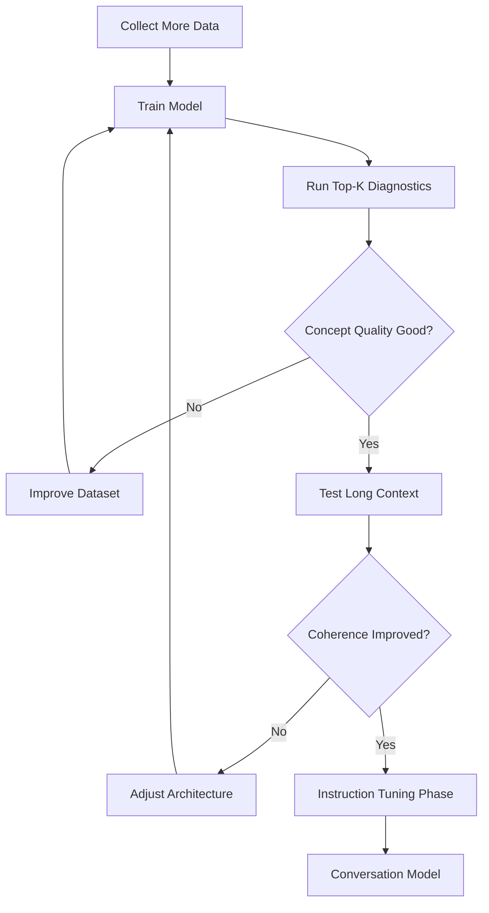

- 6/8/2026
- 6/9/2026


# 2026-06-08 - Validation tracking and early stopping --min_gpt_generalized_32block.pth
Dit experiment is heel informatief, omdat het laat zien dat **block_size verhogen alleen het probleem niet oplost**.

De belangrijkste cijfers zijn:

| Epoch | Train Loss | Val Loss         |
| ----- | ---------- | ---------------- |
| 1     | 7.41       | 6.18             |
| 2     | 6.26       | 5.73             |
| 3     | 4.96       | **5.55 (beste)** |
| 8     | 2.17       | 6.34             |

Je ziet vanaf epoch 3:

```txt
Train loss ↓
Validation loss ↑
```

Dat is klassiek overfitting.

---

### Wat mij het meest opvalt

Je hebt nu:

```txt
737k parameters
16k training tokens
```

Dat is nog steeds extreem weinig data voor een transformer.

Ruwe verhouding:

```txt
737.000 parameters
16.000 tokens
≈ 46 parameters per token
```

Dat is nog steeds heel hoog.

---

### De gegenereerde tekst

```txt
programming is all. popular culture as part of the city’s concludes.
```

is eigenlijk niet veel beter dan de vorige versie.

Het model heeft geen sterke koppeling geleerd tussen:

```txt
programming
↔ software
↔ code
↔ computer
```

Dat zou je verwachten als die kennis echt verankerd was.

---

### Een interessant signaal

Je output bevat:

```txt
fast lookups
test automation
supports conclusions
economics
networks
```

Dat zijn stukjes die duidelijk uit verschillende domeinen komen.

Dat betekent dat het model:

* woorden kent
* sommige lokale relaties kent
* maar geen stabiele conceptclusters vormt

---

### Mijn hypothese

Ik vermoed dat het probleem nu niet meer primair `block_size=8` was.

Ik denk dat het huidige probleem eerder één van deze is:

#### Mogelijkheid 1: Dataset te klein

20.000 tokens is ongeveer:

```txt
10–15 pagina's tekst
```

voor een transformer van deze omvang.

Dat is weinig.

---

#### Mogelijkheid 2: Tokenisatie

Je gebruikt:

```txt
max_vocab = 5000
```

Maar ik zie:

```txt
<UNK>
```

in eerdere output.

Een GPT-achtige tokenizer hoort eigenlijk bijna nooit `<UNK>` nodig te hebben.

Moderne GPT's gebruiken subword-tokenisatie (BPE, WordPiece, SentencePiece).

Als jij veel woorden omzet naar:

```txt
<UNK>
```

verlies je enorme hoeveelheden informatie.

Dat zou ik serieus onderzoeken.

---

#### Mogelijkheid 3: Datasetkwaliteit

Ik zie termen zoals:

```txt
Genosha
Magneto
X-Men
Nunes
Pittwater
```

door elkaar met:

```txt
test automation
economics
networks
```

Dat lijkt op een willekeurige Wikipedia/news dump.

Voor een klein model kan zo'n dataset te divers zijn.

---

# Next Development Steps 6/9/2026

## Current Assessment

The model shows evidence of learning:

- Entity recognition is improving.
- Local context relationships are present.
- Knowledge associations are beginning to form.
- Long-range coherence remains weak.
- Domain mixing still occurs frequently.

Examples:

```text
machine learning → uses → multi-layer → neural → networks
```

```text
president donald → trump → said
```

These indicate that embeddings and attention are learning meaningful relationships.

---

## Priority 1: Build Top-K Prediction Diagnostics

Instead of evaluating only generated text, inspect the next-token probabilities.

### Example

Prompt:

```text
machine learning
```

Expected:

```text
1. uses
2. algorithms
3. models
4. data
5. neural
```

Prompt:

```text
donald trump
```

Expected:

```text
1. said
2. believes
3. announced
4. administration
5. president
```

### Why

Generated text can be misleading due to sampling.

Top-K predictions reveal what the model actually knows.

---

## Priority 2: Expand Training Data

Current dataset:

```text
20,000 tokens
```

Target:

```text
100,000+ tokens
```

Preferred:

```text
500,000+ tokens
```

### Why

The model currently learns local patterns but lacks enough examples to develop stable semantic structures.

---

## Priority 3: Improve Tokenization

Investigate:

- Unknown tokens (`<UNK>`)
- Rare word handling
- Vocabulary coverage

### Goal

Move toward subword tokenization.

Potential future options:

- BPE
- SentencePiece
- WordPiece

---

## Priority 4: Measure Concept Relationships

Create a benchmark file.

### Test Cases

| Prompt | Expected Concepts |
|----------|----------|
| python | programming, language, software |
| machine learning | data, models, neural |
| database | storage, query, sql |
| united states | government, country |
| white house | president, administration |

### Scoring

Measure how many expected concepts appear in the Top-K predictions.

---

## Priority 5: Long Context Evaluation

Current:

```text
block_size = 32
```

Test:

```text
32
64
128
```

Compare:

- Validation loss
- Generation quality
- Knowledge retention

---

## Development Workflow



---

## Future Milestones

### Milestone 1

Reliable concept prediction.

Examples:

```text
machine learning
→ data
→ models
→ algorithms
```

### Milestone 2

Stable multi-sentence coherence.

### Milestone 3

Instruction following.

Examples:

```text
Explain Python
```

```text
Write code for a calculator
```

### Milestone 4

Conversational MiniGPT.

### Milestone 5

Production-ready AI assistant.